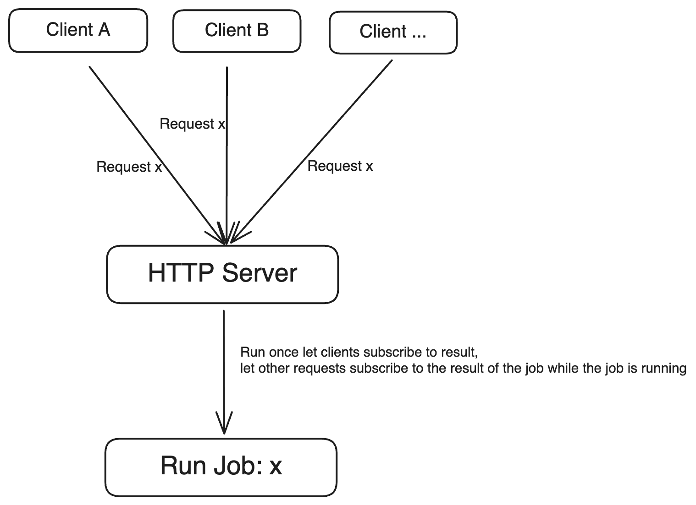
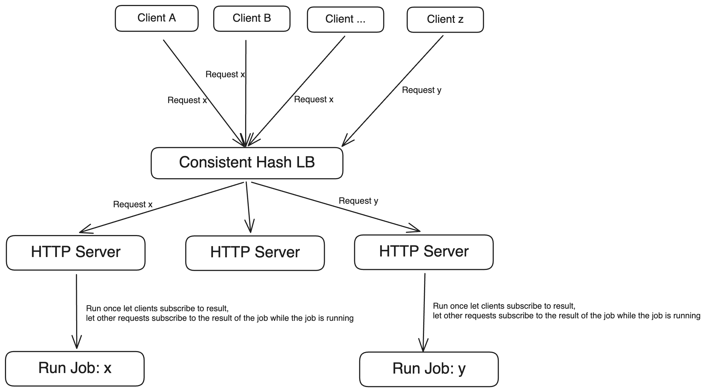

This repository contains a Go application that implements a function/job scheduler allowing for unique job execution. The core idea is to prevent multiple executions of the same job with identical parameters and instead allow clients to subscribe to ongoing jobs.



## Example Implementation
- Job Execution Time: Each job in this example takes 5 seconds to complete. Any requests made with the same parameters within these 5 seconds will subscribe to the result of the first job. This ensures that no duplicate jobs are created, and all clients receive the same result.
- Job Uniqueness: A job is defined by a unique identifier composed of its name and parameters (request_uri + args). If multiple clients request a job with the same identifier while it is still running, they will all receive the same result once it completes.
In this example implementation there are two types of jobs:

Job Types: In this implementation, there are two types of jobs:
- Calculating the nth Fibonacci number (`localhost:8080/fib/{num}`).
- Validating prime numbers (`localhost:8080/isprime/{num}`).


## Core Library
When the http wrapper is ignored it comes down to the `internal/uniquejob` package.

```golang
    type ResponseType int
	type IdentifierType string
	executor := NewJobExecutor[ResponseType, IdentifierType]() // Define the response type and the identifier type
	ctx := context.Background()
	jobIndentifier := IdentifierType("myJob")

    // Job
	jobFunc := func(context.Context) (ResponseType, error) {
		// Do some heavy computations
        return 42, nil
	}
	// Create new job
	myJob := NewJob(jobIndentifier, jobFunc)

	// Schedule Job
	subscription := executor.Execute(ctx, myJob)

	// Subscribe to results
	result, err := subscription.Subscribe(ctx) // -> 42
```

## Context in Distributed Systems
When used in a distributed system with a consistent hash load balancer, requests with the same job parameters are always routed to the same node.
This ensures that each job is executed only once across the cluster, reducing computational overhead in cases where jobs are resource-intensive and frequently duplicated.

